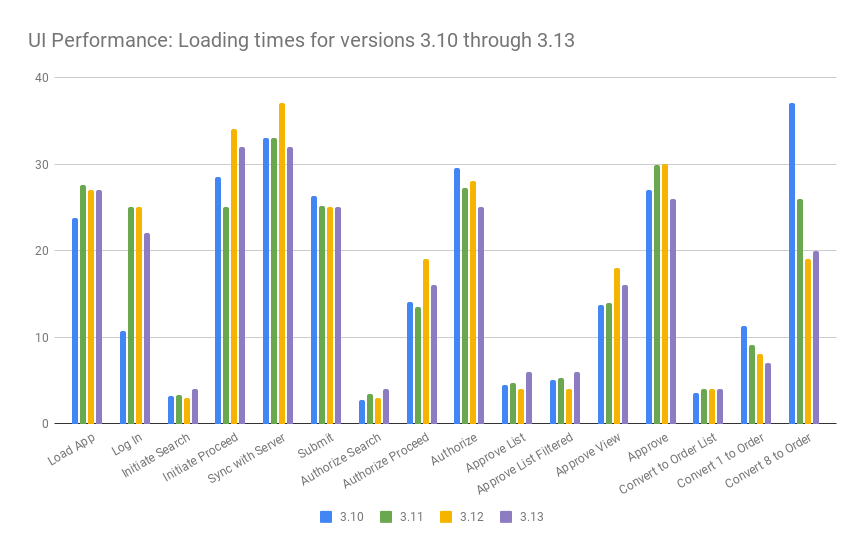

====================================
3.15.0 Release Notes - April 5, 2023
====================================

Status: Stable
===============

3.15.0 is a stable release, and all users of `OpenLMIS version 3
<https://openlmis.atlassian.net/wiki/spaces/OP/pages/88670325/3.0.0+Release+-+1+March+2017>`_ are
encouraged to adopt it.

Release Notes
=============
The OpenLMIS Community is excited to announce the **3.15.0 release** of OpenLMIS! It is another major milestone in the version 3 `re-architecture <https://openlmis.atlassian.net/wiki/display/OP/Re-Architecture>`_ that allows more functionality to be shared among the community of OpenLMIS implementers.

For a full list of features and bug-fixes since 3.14.0, see `OpenLMIS 3.15.0 Jira tickets
<https://openlmis.atlassian.net/issues/?jql=status%3DDone%20AND%20fixVersion%3D3.15%20ORDER%20BY%20%22Epic%20Link%22%20asc%2C%20key%20ASC>`_.

For information about future planned releases, see the `Living Product Roadmap
<https://openlmis.atlassian.net/wiki/display/OP/Living+Product+Roadmap>`_. Pull requests and
`contributions <http://docs.openlmis.org/en/latest/contribute/contributionGuide.html>`_ are welcome.

Compatibility
-------------

Unless noted here, all other changes to OpenLMIS 3.x are backwards-compatible. All changes to data
or schemas include automated migrations from previous versions back to version 3.0.1. All new or
altered functionality is listed in the sections below for New Features and Changes to Existing
Functionality.

Upgrading from Older Versions
~~~~~~~~~~~~~~~~~~~~~~~~~~~~~

If you are upgrading from OpenLMIS 3.0.x or 3.1.x (without first upgrading to 3.2.x), please review the `3.2.0
Release Notes <http://docs.openlmis.org/en/latest/releases/openlmis-ref-distro-v3.2.0.html>`_ for
important compatibility information about a required PostgreSQL extension and data migrations.

For information about upgrade paths from OpenLMIS 1 and 2 to version 3, see the `3.0.0 Release
Notes <https://openlmis.atlassian.net/wiki/spaces/OP/pages/88670325/3.0.0+Release+-+1+March+2017>`_.

Download or View on GitHub
--------------------------

`OpenLMIS Reference Distribution 3.15.0
<https://github.com/OpenLMIS/openlmis-ref-distro/releases/tag/v3.15.0>`_

Known Bugs
==========

Bug reports are collected in Jira for troubleshooting, analysis and resolution on an ongoing basis. See `OpenLMIS 3.15.0
Bugs <https://openlmis.atlassian.net/issues/?jql=type%20%3D%20Bug%20and%20project%20%3D%20%22OpenLMIS%20General%22%20AND%20status%20not%20in%20(Done%2CCanceled)&startIndex=200>`_ for the current list of known bugs.

To report a bug, see `Reporting Bugs
<http://docs.openlmis.org/en/latest/contribute/contributionGuide.html#reporting-bugs>`_.

New Features
============
The OpenLMIS community focused on the following work in version 3.15.0:

**Data export from UI**-Functionality allows users to export system data from UI. Before, if a user wanted to extract system data i.e. names of all currently stocked products, it had to be done by database. Functionality will be assigned to a specific role - Administrator.
**Mobile stock-on-hand functionality**-Scope of given functionality is to provide the stock cards overview for end users from the app, which is downloaded on the user’s mobile device. Functionality allows the user to view the current stock and review historical movement.
**SuperSet upgrade**-SuperSet has been upgraded to the 1.5.2 version.
**Bug fixes**
Setting Start Date for a specific program in a specific facility does not work properly
Facilities are still possible to select even after being disabled
Wrong calculations in the stock out days column

    Reference the `3.15 epics <https://openlmis.atlassian.net/issues/?filter=20614&jql=issuetype%20%3D%20Epic%20AND%20status%20in%20(Done%2C%20%22In%20Progress%22)%20AND%20fixVersion%20%3D%203.15%20ORDER%20BY%20created%20DESC>`_ for more details.

Changes to Existing Functionality
=================================

See `all 3.15 issues tagged 'UIChange' in Jira <https://openlmis.atlassian.net/issues/?jql=status%3DDone%20AND%20project%3DOLMIS%20AND%20fixVersion%3D3.15%20and%20type!%3DTest%20and%20type!%3DEpic%20and%20labels%20IN%20(UIChange)%20ORDER%20BY%20type%20ASC%2C%20priority%20DESC%2C%20key%20ASC>`_.

API Changes
===========

API changes can be found in each service CHANGELOG.md file, found in the root directory of the service repository.

Performance
========================

The performance of version 3.15 is similar to 3.14 with some modest improvements. Performance remains a high priority for the OpenLMIS community and we continue to review the overall performance picture and look for opportunities for improvements.

OpenLMIS conducted manual performance tests of the same user workflows with the same test data we used in testing v3.2.1 to establish that last-mile performance characteristics have been retained at a minimum. For details on the test results and process, please see `this wiki page <https://openlmis.atlassian.net/wiki/spaces/OP/pages/116949318/Performance+Metrics>`_.

The following chart displays the UI loading times in seconds for 3.10, 3.11, 3.12, and 3.13 using the same test data.

Test Coverage
=============

OpenLMIS 3.15.0 was tested using the established OpenLMIS Release Candidate process.  As part of this process, full manual test cycles were executed for each release candidate published. Any critical or blocker bugs found during the release candidate were resolved in a bug fix cycle with a full manual test cycle executed before releasing the final version 3.15.0. Manual tests were conducted using a set of 97 QAlity tests tracked in Jira and 7 manual tests for reporting. For more details about test executions and bugs found for this release please see `the 3.15 QA Release and Bug Triage wiki page <https://openlmis.atlassian.net/wiki/spaces/OP/pages/2320269316/The+3.15+Regression+and+Release+Candidate+Test+Plan>`_.

All Changes by Component
========================

Version 3.15.0 of the Reference Distribution contains updated versions of the components listed
below. The Reference Distribution bundles these component together using Docker to create a complete
OpenLMIS instance. Each component has its own own public GitHub repository (source code) and
DockerHub repository (release image). The Reference Distribution and components are versioned
independently; for details see `Versioning and Releasing
<http://docs.openlmis.org/en/latest/conventions/versioningReleasing.html>`_.

Auth Service 4.3.3
------------------

`Auth CHANGELOG <https://github.com/OpenLMIS/openlmis-auth/blob/master/CHANGELOG.md>`_

CCE Service 1.3.2
-----------------

`CCE CHANGELOG <https://github.com/OpenLMIS/openlmis-cce/blob/master/CHANGELOG.md>`_

Fulfillment Service 9.0.3
-------------------------

`Fulfillment CHANGELOG <https://github.com/OpenLMIS/openlmis-fulfillment/blob/master/CHANGELOG.md>`_

Notification Service 4.3.3
--------------------------

`Notification CHANGELOG <https://github.com/OpenLMIS/openlmis-notification/blob/master/CHANGELOG.md>`_

Reference Data Service 15.2.3
-----------------------------

`ReferenceData CHANGELOG <https://github.com/OpenLMIS/openlmis-referencedata/blob/master/CHANGELOG.md>`_

Report Service 1.2.2
--------------------

This service is intended to provide reporting functionality for other components to use. Built-in
reports in OpenLMIS 3.4.0 are still powered by their own services. In future releases, they may be
migrated to a new version of this centralized report service.

**Warning**: Developers should take note that the design of this service will be changing with
future releases. Developers and implementers are discouraged from using this 1.2.x version to build
additional reports.

`Report CHANGELOG <https://github.com/OpenLMIS/openlmis-report/blob/master/CHANGELOG.md>`_

Requisition Service 8.3.4
-------------------------

`Requisition CHANGELOG <https://github.com/OpenLMIS/openlmis-requisition/blob/master/CHANGELOG.md>`_

Stock Management 5.1.6
----------------------

`Stock Management CHANGELOG <https://github.com/OpenLMIS/openlmis-stockmanagement/blob/master/CHANGELOG.md>`_

Reference UI 5.2.3
------------------

`The Reference UI <https://github.com/OpenLMIS/openlmis-reference-ui/>`_
is the web-based user interface for the OpenLMIS Reference Distribution. This user interface is
a single page web application that is optimized for offline and low-bandwidth environments.
The Reference UI is compiled together from module UI modules using Docker compose along with the
OpenLMIS dev-ui. UI modules included in the Reference UI are:

Reference Data-UI 5.6.6
~~~~~~~~~~~~~~~~~~~~~~~

`ReferenceData-UI CHANGELOG <https://github.com/OpenLMIS/openlmis-referencedata-ui/blob/master/CHANGELOG.md>`_

Auth-UI 6.2.8
~~~~~~~~~~~~~

`Auth-UI CHANGELOG <https://github.com/OpenLMIS/openlmis-auth-ui/blob/master/CHANGELOG.md>`_

CCE-UI 1.1.1
~~~~~~~~~~~~

`CCE-UI CHANGELOG <https://github.com/OpenLMIS/openlmis-cce-ui/blob/master/CHANGELOG.md>`_

Fulfillment-UI 6.1.1
~~~~~~~~~~~~~~~~~~~~

`Fulfillment-UI CHANGELOG <https://github.com/OpenLMIS/openlmis-fulfillment-ui/blob/master/CHANGELOG.md>`_

Report-UI 5.2.8
~~~~~~~~~~~~~~~

`Report-UI CHANGELOG <https://github.com/OpenLMIS/openlmis-report-ui/blob/master/CHANGELOG.md>`_

Requisition-UI 7.0.7
~~~~~~~~~~~~~~~~~~~~

`Requisition-UI CHANGELOG <https://github.com/OpenLMIS/openlmis-requisition-ui/blob/master/CHANGELOG.md>`_

Stock Management-UI 2.1.2
~~~~~~~~~~~~~~~~~~~~~~~~~

`Stock Management-UI CHANGELOG <https://github.com/OpenLMIS/openlmis-stockmanagement-ui/blob/master/CHANGELOG.md>`_

UI-Components 7.2.7
~~~~~~~~~~~~~~~~~~~

`UI-Components CHANGELOG <https://github.com/OpenLMIS/openlmis-ui-components/blob/master/CHANGELOG.md>`_

UI-Layout 5.2.1
~~~~~~~~~~~~~~~

`UI-Layout CHANGELOG <https://github.com/OpenLMIS/openlmis-ui-layout/blob/master/CHANGELOG.md>`_

Dev UI 9.0.3
~~~~~~~~~~~~

The `Dev-UI CHANGLOG <https://github.com/OpenLMIS/dev-ui/blob/master/CHANGELOG.md>`_

Components with No Changes
==========================

The components that have not changed are:

- `Service Util <https://github.com/OpenLMIS/openlmis-service-util>`_
- `Logging Service <https://github.com/OpenLMIS/openlmis-rsyslog>`_
- Consul-friendly distribution of `nginx <https://github.com/OpenLMIS/openlmis-nginx>`_
- Docker `Postgres 9.6-postgis image <https://github.com/OpenLMIS/postgres>`_
- Docker `scalyr image <https://github.com/OpenLMIS/openlmis-scalyr>`_

Contributions
=============

Many organizations and individuals around the world have contributed to OpenLMIS version 3 by
serving on our committees (Governance, Product and Technical), requesting improvements, suggesting
features and writing code and documentation. Please visit our GitHub repos to see the list of
individual contributors on the OpenLMIS codebase. If anyone who contributed in GitHub is missing,
please contact the Community Manager.

Thanks to the Malawi implementation team who has continued to contribute a number of changes
that have global shared benefit.

Further Resources
=================

Please see the Implementer Toolkit on the `OpenLMIS website <http://openlmis.org/get-started/implementer-toolkit/>`_ to learn more about best practicies in implementing OpenLMIS.  Also, learn more about the `OpenLMIS Community <http://openlmis.org/about/community/>`_ and how to get involved!
