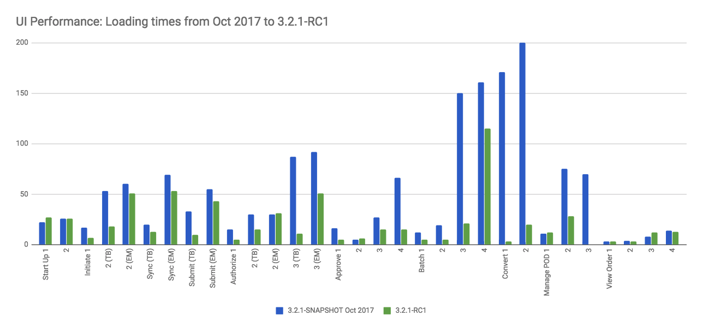

======================================
3.2.1 Release Notes - 15 November 2017
======================================

Status: Stable
==============

3.2.1 is a stable release, and all users of `OpenLMIS version 3
<https://openlmis.atlassian.net/wiki/spaces/OP/pages/88670325/3.0.0+Release+-+1+March+2017>`_ are
encouraged to adopt it.

Release Notes
=============

The release of 3.2.1 is primarily a **bug-fix** and **performance** release, with `over 40 bugs
fixed and over 20 other improvements <https://openlmis.atlassian.net/issues/?jql=status%3DDone%20AND%20project%3DOLMIS%20AND%20fixVersion%3D3.2.1%20and%20type!%3DTest%20and%20type!%3DEpic%20ORDER%20BY%20type%20ASC%2C%20priority%20DESC%2C%20key%20ASC>`_
since 3.2.0 including major improvements in performance.

This release does include some new features; see the New Features section below.

See the `Living Product Roadmap
<https://openlmis.atlassian.net/wiki/display/OP/Living+Product+Roadmap>`_ for information about
future planned releases. Pull requests and `contributions
<http://docs.openlmis.org/en/latest/contribute/contributionGuide.html>`_ are welcome.

Compatibility
-------------

**Important! Stock Management data migration**: OpenLMIS 3.2.1 introduces a new constraint that
forces the adjustment reasons to be unique within each requisition line item. This means that it
will no longer be possible to have two "expired" adjustments in a single product, eg. Expired: 20
and Expired: 30. It will still be possible to have different adjustment reasons, eg. Expired: 20
and Lost: 30. The UI does not allow users to add the same adjustment reason twice starting with
OpenLMIS 3.2.1. Users should now provide a total value for a given adjustment reason.

Due to this change, it is necessary for any existing OpenLMIS implementations to migrate their
stock adjustments data to merge any duplicates. Implementations can do this manually before
upgrading to 3.2.1, otherwise OpenLMIS 3.2.1 will apply a default migration automatically. The
default migration automatically merge the duplicates by adding together the quantities from the
same adjustment reasons in each requisition line item. For instance, if a line item had two
adjustments with the same reason (Expired: 20 and Expired: 30), this will be replaced by a single
adjustment with the total (Expired: 50). We highly recommend that all implementations review their
duplicate stock adjustments manually and determine how they should be merged prior to upgrading to
3.2.1. The default migration may not be valid for all the cases that can occur in real-world data.

**Batch Requisition Approval**: During work on OpenLMIS 3.2.1, further improvements to the Batch
Approval screen were made, but the feature is still not officially supported. The UI screen is
disabled. Implementations can override the code in their local customizations in order to use the
screen. Further changes to the screen are expected in future releases before it is officially
supported. See `OLMIS-3182 <https://openlmis.atlassian.net/browse/OLMIS-3182>`_ for more info.

Backwards-Compatible Except As Noted
~~~~~~~~~~~~~~~~~~~~~~~~~~~~~~~~~~~~

Unless noted here, all other changes to OpenLMIS 3.x are backwards-compatible. All changes to data
or schemas include automated migrations from previous versions back to version 3.0.1. All new or
altered functionality is listed in the sections below for New Features and Changes to Existing
Functionality.

Upgrading from Older Versions
~~~~~~~~~~~~~~~~~~~~~~~~~~~~~

If you are upgrading to OpenLMIS 3.2.1 from OpenLMIS 3.0.x or 3.1.x, please review the `3.2.0
Release Notes <http://docs.openlmis.org/en/latest/releases/openlmis-ref-distro-v3.2.0.html>`_ for
important compatibility information.

For information about upgrade paths from OpenLMIS 1 and 2 to version 3, see the `3.0.0 Release
Notes <https://openlmis.atlassian.net/wiki/spaces/OP/pages/88670325/3.0.0+Release+-+1+March+2017>`_.

Download or View on GitHub
--------------------------

`OpenLMIS Reference Distribution 3.2.1
<https://github.com/OpenLMIS/openlmis-ref-distro/releases/tag/v3.2.1>`_

Known Bugs
==========

Bug reports are collected in Jira for troubleshooting, analysis and resolution. See `OpenLMIS 3.2.1
Bugs <https://openlmis.atlassian.net/issues/?jql=project%3DOLMIS%20and%20type%3DBug%20and%20affectedVersion%3D3.2.1%20order%20by%20priority%20DESC%2C%20status%20ASC%2C%20key%20ASC>`_.

To report a bug, see `Reporting Bugs
<http://docs.openlmis.org/en/latest/contribute/contributionGuide.html#reporting-bugs>`_.

New Features
============

OpenLMIS 3.2.1 contains these new features:

- Facility administration screens now support adding and editing facilities.
- User administration screens now provide filtering and more password reset options.
- Demo data is significantly expanded, including for use in contract tests and performance tests.
- `Vaccine MVP 
  <https://openlmis.atlassian.net/wiki/spaces/OP/pages/113144940/Vaccine+MVP>`_ features including
  Ideal Stock Amount (ISA) management, printing of physical inventory counts and additional work in Cold Chain
  Equipment (CCE) tracking (CCE features are released in a Beta version which is not included in the
  3.2.1 release).
- Contributions from the Malawi implementation, including a new Extension Point for customizing
  Order Numbers and deleting previously skipped requisitions.

Changes to Existing Functionality
=================================

Version 3.2.1 contains changes that impact users of existing functionality. Please review these
changes which may require informing end-users and/or updating your customizations/extensions:

- `OLMIS-3233 <https://openlmis.atlassian.net/browse/OLMIS-3233>`_: Ability to delete previously
  skipped Requisitions.
- `OLMIS-3076 <https://openlmis.atlassian.net/browse/OLMIS-3076>`_: DataIntegrityViolationException
  when trying to remove previous requisition / Average Period Consumption should not calculate
  using Emergency requisition data. This change updates the rules about when it is possible to
  delete older requisitions. It also changes how newer requisitions use past data to compute the
  Average Period Consumption.
- `OLMIS-3246 <https://openlmis.atlassian.net/browse/OLMIS-3246>`_: Ability to hide special reasons
  from Total Losses and Adjustments. This feature provides a new configuration option so that
  administrators can hide selected reasons from end-users.
- `OLMIS-3221 <https://openlmis.atlassian.net/browse/OLMIS-3221>`_ and `OLMIS-3222
  <https://openlmis.atlassian.net/browse/OLMIS-3222>`_: View Orders filtering by period start and
  end dates.
- `OLMIS-2700 <https://openlmis.atlassian.net/browse/OLMIS-2700>`_: View Requisition enhancements.
  This includes new sort order controls and makes the Date Initiated visible in the table.
- `OLMIS-3449 <https://openlmis.atlassian.net/browse/OLMIS-3449>`_: Explanation field on Non-Full
  Supply is no longer mandatory.

See `all 3.2.1 issues tagged 'UIChange' in Jira <https://openlmis.atlassian.net/issues/?jql=status%3DDone%20AND%20project%3DOLMIS%20AND%20fixVersion%3D3.2.1%20and%20type!%3DTest%20and%20type!%3DEpic%20and%20labels%20IN%20(UIChange)%20ORDER%20BY%20type%20ASC%2C%20priority%20DESC%2C%20key%20ASC>`_.

API Changes
===========

Some APIs have changes to their contracts and/or their request-response data structures. These
changes impact developers and systems integrating with OpenLMIS:

- `OLMIS-3254 <https://openlmis.atlassian.net/browse/OLMIS-3254>`_: Unrestrict GET operations on
  certain reference data resources. This makes certain information (EG, lists of all facilities
  and orderables) available for any user with a valid login token.
- `OLMIS-3116 <https://openlmis.atlassian.net/browse/OLMIS-3116>`_: User DTO now returns home facility UUID instead of Facility object.
- `OLMIS-3105 <https://openlmis.atlassian.net/browse/OLMIS-3105>`_: User DTO now returns UUIDs instead of codes for role assignments.
- `OLMIS-3293 <https://openlmis.atlassian.net/browse/OLMIS-3293>`_: Paginate search facilityTypeApprovedProducts and made endpoint RESTful.
- `OLMIS-2732 <https://openlmis.atlassian.net/browse/OLMIS-2732>`_: Stock Management Physical
  Inventory API was redesigned to be RESTful (during work on this ticket for print support).

Performance Improvements
========================

Targeted performance improvements were made in the RESTful API services as well as in the UI
application. The improvements were chosen based on testing using a new performance data set and by
manually testing with simulated conditions (EG, network set to Slow 3G).

This chart shows a side-by-side comparison of the loading times for different actions in the UI
in version 3.2.1 (green) compared to testing done in early October 2017 before improvements (blue).

These loading times are measured from the UI app with network set to Slow 3G and CPU throttled.
The data was gathered manually by timing the application while running the new performance data set.

Top Areas Improved in 3.2.1:

- Convert to Order has dramatically improved loading times (now under 20 seconds): `OLMIS-3318 <https://openlmis.atlassian.net/browse/OLMIS-3318>`_ and `OLMIS-3320 <https://openlmis.atlassian.net/browse/OLMIS-3320>`_.
- Requisition Approve is significantly faster (now under 15 seconds): `OLMIS-3346 <https://openlmis.atlassian.net/browse/OLMIS-3346>`_.
- Requisition Initiate is faster. `OLMIS-3332 <https://openlmis.atlassian.net/browse/OLMIS-3332>`_ and `OLMIS-3322 <https://openlmis.atlassian.net/browse/OLMIS-3322>`_.
- Requisition Submit and Authorize are also faster (improved by those same tickets).
- Batch Approve performs better scrolling through large numbers of products.

For more info about the data and results, see: https://openlmis.atlassian.net/wiki/spaces/OP/pages/116949318/Performance+Metrics

Test Coverage
=============

OpenLMIS 3.2.1 is the first release using the new `Release Candidate process
<http://docs.openlmis.org/en/latest/conventions/versioningReleasing.html#release-process>`_. As part
of this process, a full manual regression test cycle was conducted, and multiple release candidates
were published to address critical bugs before releasing the final version 3.2.1.

Manual tests were conducted using a set of 110 Zephyr tests tracked in Jira. A total of 34 bugs were
found during testing. The full set of 110 tests was executed on the first Release Candidate (RC1).
With subsequent release candidates (RC2 and RC3), a smaller set of tests were re-executed based on
which components were changed. In total, 34 bugs were found from all rounds of manual testing for
3.2.1. See a spreadsheet of all regression test executions for this release:
`3.2.1-regression-tests.csv <https://raw.githubusercontent.com/OpenLMIS/openlmis-ref-distro/master/docs/source/releases/3.2.1-regression-tests.csv>`_.

The automated tests (unit tests, integration tests, and contract tests) were 100% passing at the time
of the 3.2.1 release. Automated test coverage is tracked in `Sonar
<http://sonar.openlmis.org/projects>`_.

All Changes by Component
========================

Version 3.2.1 of the Reference Distribution contains updated versions of the components listed
below. The Reference Distribution bundles these component together using Docker to create a complete
OpenLMIS instance. Each component has its own own public GitHub repository (source code) and
DockerHub repository (release image). The Reference Distribution and components are versioned
independently; for details see `Versioning and Releasing
<http://docs.openlmis.org/en/latest/conventions/versioningReleasing.html>`_.

Auth Service 3.1.1
------------------

Bug fixes added in a backwards-compatible manner:

- `OLMIS-3119 <https://openlmis.atlassian.net/browse/OLMIS-3119>`_: Fixed issue with TOKEN_DURATION variable being ingored, which in reality was an issue with set up of the Spring context and autowiring not working as expected.
- `OLMIS-3357 <https://openlmis.atlassian.net/browse/OLMIS-3357>`_: Reset email will not be sent when user is created or updated.

Source: `Auth CHANGELOG <https://github.com/OpenLMIS/openlmis-auth/blob/master/CHANGELOG.md>`_

CCE Service 1.0.0-beta
----------------------

This component is a **beta** of new Cold Chain Equipment functionality to support Vaccines in
medical supply chains. This API service component has an accompanying beta CCE UI component.

For details, see the functional documentation: `Cold Chain Equipment Management
<https://openlmis.atlassian.net/wiki/spaces/OP/pages/113145252/Cold+Chain+Equipment+Management>`_.

*Warning: This is a beta component, and is not yet intended for production use. APIs and
functionality are still subject to change until the official release.*

Fulfillment Service 6.1.0
-------------------------

New functionality added in a backwards-compatible manner:

- `OLMIS-3221 <https://openlmis.atlassian.net/browse/OLMIS-3221>`_: Added period start and end dates parameters to the order search endpoint.

Improvements added in a backwards-compatible manner:

- `OLMIS-3112 <https://openlmis.atlassian.net/browse/OLMIS-3112>`_: Added OrderNumberGenerator extension point. Changed the default implementation to provide 8 character, base36 order numbers.

Source: `Fulfillment CHANGELOG
<https://github.com/OpenLMIS/openlmis-fulfillment/blob/master/CHANGELOG.md>`_

Notification Service 3.0.4
--------------------------

Bug fixes, security and performance improvements (backwards-compatible):

- `OLMIS-3394 <https://openlmis.atlassian.net/browse/OLMIS-3394>`_: Added notification request validator. From, to, subject and content fields are required, and if one of them will be empty the endpoint will return response with 400 status code and error message.

Source: `Notification CHANGELOG
<https://github.com/OpenLMIS/openlmis-notification/blob/master/CHANGELOG.md>`_

Reference Data Service 9.0.0
----------------------------

Breaking changes:

- `OLMIS-3116 <https://openlmis.atlassian.net/browse/OLMIS-3116>`_: User DTO now returns home facility UUID instead of Facility object.
- `OLMIS-3105 <https://openlmis.atlassian.net/browse/OLMIS-3105>`_: User DTO now returns UUIDs instead of codes for role assignments.
- `OLMIS-3293 <https://openlmis.atlassian.net/browse/OLMIS-3293>`_: Paginate search facilityTypeApprovedProducts and made endpoint RESTful.

New functionality added in a backwards-compatible manner:

- `OLMIS-2892 <https://openlmis.atlassian.net/browse/OLMIS-2892>`_: Added ideal stock amounts model.
- `OLMIS-2966 <https://openlmis.atlassian.net/browse/OLMIS-2966>`_: Create User Rights for Managing Ideal Stock Amounts.
- `OLMIS-3227 <https://openlmis.atlassian.net/browse/OLMIS-3227>`_: Added GET Ideal Stock Amounts endpoint with download csv functionality.
- `OLMIS-3022 <https://openlmis.atlassian.net/browse/OLMIS-3022>`_: Refresh right assignments on role-based access control (RBAC) structural changes.
- `OLMIS-3263 <https://openlmis.atlassian.net/browse/OLMIS-3263>`_: Added new ISA dto with links to nested objects.
- `OLMIS-396 <https://openlmis.atlassian.net/browse/OLMIS-396>`_: Added ISA upload endpoint.
- `OLMIS-3200 <https://openlmis.atlassian.net/browse/OLMIS-3200>`_: Designed and added new demo data for EPI (Vaccines) program.
- `OLMIS-3254 <https://openlmis.atlassian.net/browse/OLMIS-3254>`_: Un-restrict most GET APIs for most resources.
- `OLMIS-3351 <https://openlmis.atlassian.net/browse/OLMIS-3351>`_: Added search by ids to /api/facilities endpoint.
- `OLMIS-3512 <https://openlmis.atlassian.net/browse/OLMIS-3512>`_: Added code validation for supervisory node create and update endpoints.

Bug fixes, security and performance improvements, also backwards-compatible:

- `OLMIS-2857 <https://openlmis.atlassian.net/browse/OLMIS-2857>`_: Refactored user search repository method to user database pagination and sorting.
- `OLMIS-2913 <https://openlmis.atlassian.net/browse/OLMIS-2913>`_: add DIVO user and assign to Inventory Manager role for SN1 and SN2.
- `OLMIS-3146 <https://openlmis.atlassian.net/browse/OLMIS-3146>`_: added PROGRAMS_MANAGE right and enforce it on CUD endpoints.
- `OLMIS-3209 <https://openlmis.atlassian.net/browse/OLMIS-3209>`_: Fixed problem with parsing orderable DTO when it contains several program orderables.
- `OLMIS-3290 <https://openlmis.atlassian.net/browse/OLMIS-3290>`_: Fixed searching Orderables by code and name.
- `OLMIS-3291 <https://openlmis.atlassian.net/browse/OLMIS-3291>`_: Fixed searching RequisitionGroups by supervisoryNode.
- `OLMIS-3346 <https://openlmis.atlassian.net/browse/OLMIS-3346>`_: Decreased number of database calls to retrieve Facility Type Approved Products.

Source: `ReferenceData CHANGELOG
<https://github.com/OpenLMIS/openlmis-referencedata/blob/master/CHANGELOG.md>`_

Reference UI 5.0.4
------------------

The Reference UI (`https://github.com/OpenLMIS/openlmis-reference-ui/ <https://github.com/OpenLMIS/openlmis-reference-ui/>`_)
is the web-based user interface for the OpenLMIS Reference Distribution. This user interface is
a single page web application that is optimized for offline and low-bandwidth environments.
The Reference UI is compiled together from module UI modules using Docker compose along with the
OpenLMIS dev-ui. UI modules included in the Reference UI are:

auth-ui 6.0.0
~~~~~~~~~~~~~

New functionality:

- `OLMIS-2956 <https://openlmis.atlassian.net/browse/OLMIS-2956>`_: Simplified login and authorization services by removing "user rights" functionality and moving to openlmis-referencedata-ui.

New functionality added in backwards-compatiable manner:

- `OLMIS-3141 <https://openlmis.atlassian.net/browse/OLMIS-3141>`_: After user resets their password, they are redirected to the login screen.
- `OLMIS-3283 <https://openlmis.atlassian.net/browse/OLMIS-3283>`_: Added a "Show password" option on password reset screen.

Bug fixes which are backwards-compatible:

- `OLMIS-3140 <https://openlmis.atlassian.net/browse/OLMIS-3140>`_: Added loading icon on forgot password modal.

Improvements:

- Updated dev-ui version to 6.

See `openlmis-auth-ui CHANGELOG
<https://github.com/OpenLMIS/openlmis-auth-ui/blob/master/CHANGELOG.md>`_

cce-ui 1.0.0-beta
~~~~~~~~~~~~~~~~~

Beta release of `CCE UI <https://github.com/OpenLMIS/openlmis-cce-ui>`_. See CCE service component
above for more info.

fulfillment-ui 5.1.0
~~~~~~~~~~~~~~~~~~~~

New functionality added in a backwards-compatible manner:

- `OLMIS-3222 <https://openlmis.atlassian.net/browse/OLMIS-3222>`_: Added period start and end dates parameters to the order view screen

Bug fixes:

- `OLMIS-3159 <https://openlmis.atlassian.net/browse/OLMIS-3159>`_: Fixed facility select loosing state no POD manage page.
- `OLMIS-3285 <https://openlmis.atlassian.net/browse/OLMIS-3285>`_: Fixed broken pagination on Manage Proofs of Delivery page.
- `OLMIS-3540 <https://openlmis.atlassian.net/browse/OLMIS-3540>`_: Now Manage POD displays items with IN_ROUTE status.

Improvements:

- Updated dev-ui version to 6.

See `openlmis-fulfillment-ui CHANGELOG
<https://github.com/OpenLMIS/openlmis-fulfillment-ui/blob/master/CHANGELOG.md>`_

referencedata-ui 5.2.2
~~~~~~~~~~~~~~~~~~~~~~

New features:

- `OLMIS-3153 <https://openlmis.atlassian.net/browse/OLMIS-3153>`_: Added facilityOperatorsService for communicating with the facilityOperators endpoints
- Extended facilityService with the ability to save facility
- `OLMIS-3154 <https://openlmis.atlassian.net/browse/OLMIS-3154>`_: Changed facility view to edit screen.
- `OLMIS-3228 <https://openlmis.atlassian.net/browse/OLMIS-3228>`_: Create Download Current ISA Values page.
- `OLMIS-2217 <https://openlmis.atlassian.net/browse/OLMIS-2217>`_: Added ability to send reset password email.
- `OLMIS-396 <https://openlmis.atlassian.net/browse/OLMIS-396>`_: Added upload functionality to manage ISA screen.

Improvements:

- `OLMIS-2857 <https://openlmis.atlassian.net/browse/OLMIS-2857>`_: Added username filter to user list screen.
- `OLMIS-3283 <https://openlmis.atlassian.net/browse/OLMIS-3283>`_: Added a "Show password" option on password reset screen.
- `OLMIS-3296 <https://openlmis.atlassian.net/browse/OLMIS-3296>`_: Reworked facility-program select component to use cached rograms, minimal facilities and permission strings.
- Updated dev-ui version to 6.

Bug fixes:

- Added openlmis-offline as a dependency to the referencedata-program module.
- OLMIS-3291: Fixed incorrect state name.
- OLMIS-3499: Fixed changing username in title header.

See `openlmis-referencedata-ui CHANGELOG
<https://github.com/OpenLMIS/openlmis-referencedata-ui/blob/master/CHANGELOG.md>`_

report-ui 5.0.4
~~~~~~~~~~~~~~~

Improvements:

- Updated dev-ui version to 6.

See `openlmis-report-ui CHANGELOG
<https://github.com/OpenLMIS/openlmis-report-ui/blob/master/CHANGELOG.md>`_

requisition-ui 5.2.0
~~~~~~~~~~~~~~~~~~~~

Improvements:

- `OLMIS-2956 <https://openlmis.atlassian.net/browse/OLMIS-2956>`_: Removed UserRightFactory from requisition-initiate module, and replaced with permissionService.
- `OLMIS-3294 <https://openlmis.atlassian.net/browse/OLMIS-3294>`_: Added loading modal after the approval is finished.
- `OLMIS-2700 <https://openlmis.atlassian.net/browse/OLMIS-2700>`_: Added date initiated column and sorting to the View Requisitions table. Removed date authorized and date approved.
- `OLMIS-3181 <https://openlmis.atlassian.net/browse/OLMIS-3181>`_: Added front-end validation to the requisition batch approval screen.
- `OLMIS-3233 <https://openlmis.atlassian.net/browse/OLMIS-3233>`_: Added ability to delete requisitions with "skipped" status.
- `OLMIS-3246 <https://openlmis.atlassian.net/browse/OLMIS-3246>`_: Added 'show' field to reason assignments.
- `OLMIS-3471 <https://openlmis.atlassian.net/browse/OLMIS-3471>`_: Explanation field on Non Full supply tab is no longer mandatory.
- `OLMIS-3318 <https://openlmis.atlassian.net/browse/OLMIS-3318>`_: Added requisitions caching to the Convert to Order screen.
- Updated dev-ui version to 6.

Bug fixes:

- `OLMIS-3151 <https://openlmis.atlassian.net/browse/OLMIS-3151>`_: Fixed automatically resolving mathematical error with adjustments.
- `OLMIS-3255 <https://openlmis.atlassian.net/browse/OLMIS-3255>`_: Fixed auto-select the "Supplying facility" on Requisition Convert to Order.
- `OLMIS-3296 <https://openlmis.atlassian.net/browse/OLMIS-3296>`_: Reworked facility-program select component to use cached programs, minimal facilities and permission strings.
- `OLMIS-3322 <https://openlmis.atlassian.net/browse/OLMIS-3322>`_: Added storing initiated requisition in offline cache.

See `openlmis-requisition-ui CHANGELOG
<https://github.com/OpenLMIS/openlmis-requisition-ui/blob/master/CHANGELOG.md>`_

stockmanagement-ui 1.0.1
~~~~~~~~~~~~~~~~~~~~~~~~

New functionality that are backwards-compatible:

- `OLMIS-2732 <https://openlmis.atlassian.net/browse/OLMIS-2732>`_: Print submitted physical inventory.

Improvements:

- `OLMIS-3246 <https://openlmis.atlassian.net/browse/OLMIS-3246>`_: Added support for hidden stock adjustment reasons.
- `OLMIS-3296 <https://openlmis.atlassian.net/browse/OLMIS-3296>`_: Reworked facility-program select component to use cached rograms, minimal facilities and permission strings.
- Updated dev-ui version to 6.

See `openlmis-ui-components CHANGELOG
<https://github.com/OpenLMIS/openlmis-stockmanagement-ui/blob/master/CHANGELOG.md>`_

ui-components 5.2.0
~~~~~~~~~~~~~~~~~~~

ui-components 5.2.0 contains significant new functionality including virtual table scrolling for
improved performance of large tables, a new sort control, PouchDB support, improved Offline
detection and much more.

New functionality added in a backwards-compatible manner:

- `OLMIS-3182 <https://openlmis.atlassian.net/browse/OLMIS-3182>`_: Added openlmis-table-pane that implements high performance table rendering for large data tables.
- `OLMIS-2655 <https://openlmis.atlassian.net/browse/OLMIS-2655>`_: Added sort control component.
- `OLMIS-3462 <https://openlmis.atlassian.net/browse/OLMIS-3462>`_: Added debounce option for inputs.
- `OLMIS-3199 <https://openlmis.atlassian.net/browse/OLMIS-3199>`_: Added PouchDB.

New functionality:

- Added modalStateProvider to ease modal state defining

Bug fixes:

- `OLMIS-3248 <https://openlmis.atlassian.net/browse/OLMIS-3248>`_: Added missing message for number validation.
- `OLMIS-3170 <https://openlmis.atlassian.net/browse/OLMIS-3170>`_: Fixed auto resize input controls.
- `OLMIS-3500 <https://openlmis.atlassian.net/browse/OLMIS-3500>`_: Fixed a bug with background changing color when scrolling.

Improvements:

- `OLMIS-3114 <https://openlmis.atlassian.net/browse/OLMIS-3114>`_: Improved table keyboard accessibility. Made table scroll if focused cell is off screen. Wrapped checkboxes in table cells automatically if they don't have a label.
- Modals now have backdrop and escape close actions disabled by default. Can by overridden by adding 'backdrop' and 'static' properties to the dialog definition.
- Extended stateTrackerService with the ability to override previous state parameters and pass state options.
- Updated dev-ui version to 6.
- `OLMIS-3359 <https://openlmis.atlassian.net/browse/OLMIS-3359>`_: Improved the way offline is detected.

See `openlmis-ui-components CHANGELOG
<https://github.com/OpenLMIS/openlmis-ui-components/blob/master/CHANGELOG.md>`_

ui-layout:5.0.3
~~~~~~~~~~~~~~~

New features:

- `OLMIS-2956 <https://openlmis.atlassian.net/browse/OLMIS-2956>`_: Added loadingService with $stateChangeStart interceptor

Improvements:

- `OLMIS-3303 <https://openlmis.atlassian.net/browse/OLMIS-3303>`_: Added warning for users with Javascript disabled
- Updated dev-ui version to 6.

See `openlmis-ui-layout CHANGELOG
<https://github.com/OpenLMIS/openlmis-ui-layout/blob/master/CHANGELOG.md>`_

Dev UI
~~~~~~

The `Dev UI developer tooling <https://github.com/OpenLMIS/dev-ui>`_ has advanced to v6.

Report Service 1.0.0
--------------------

This new service is intended to provide reporting functionality for other components to use. It is a
1.0.0 release which is stable for production use, and it powers one built-in report: the Facility
Assignment Configuration Errors report
(`OLMIS-2760 <https://openlmis.atlassian.net/browse/OLMIS-2760>`_).

Additional built-in reports in OpenLMIS 3.2.1 are still powered by their own services. In future
releases, they may be migrated to a new version of this centralized report service.

**Warning**: Developers should take note that the design of this service will be changing with
future releases. Developers and implementers are discouraged from using this 1.0.0 version to build
additional reports.

Changes since Report Service 1.0.0-beta:

- `OLMIS-3116 <https://openlmis.atlassian.net/browse/OLMIS-3116>`_: Change user home facility from Facility DTO to UUID

Requisition Service 5.1.0
-------------------------

Improvements:

- `OLMIS-3544 <https://openlmis.atlassian.net/browse/OLMIS-3544>`_: Added sort to requisition search endpoint.
- `OLMIS-3246 <https://openlmis.atlassian.net/browse/OLMIS-3246>`_: Added support for hidden stock adjustment reasons.
  Also added validations to ensure all special reasons configured for Requisition service to use are valid reasons.
- `OLMIS-3233 <https://openlmis.atlassian.net/browse/OLMIS-3233>`_: Added ability to delete requisitions with Skipped status.
- `OLMIS-3351 <https://openlmis.atlassian.net/browse/OLMIS-3351>`_: Improve performance of batch retrieveAll.

Bug fixes added in a backwards-compatible manner:

- `OLMIS-3126 <https://openlmis.atlassian.net/browse/OLMIS-3126>`_: Fix unable to batch save when skip is disabled in Requisition Template.
- `OLMIS-3215 <https://openlmis.atlassian.net/browse/OLMIS-3215>`_: Do not allow for status change (submit/authorize/approve) when period end after today.
- `OLMIS-3076 <https://openlmis.atlassian.net/browse/OLMIS-3076>`_: Exclude emergency from previous requisitions, remove regular requisition only if it is newest.
- `OLMIS-3320 <https://openlmis.atlassian.net/browse/OLMIS-3320>`_: Improved requisitions for convert endpoint performance.
- `OLMIS-3404 <https://openlmis.atlassian.net/browse/OLMIS-3404>`_: Added validation for sending reasons in line item adjustments that are not present on available reason list in requisition.

Improve demo data:

- `OLMIS-3202 <https://openlmis.atlassian.net/browse/OLMIS-3202>`_: Modified requisition template for EM program to match Malawi example columns.

Source: `Requisition CHANGELOG
<https://github.com/OpenLMIS/openlmis-requisition/blob/master/CHANGELOG.md>`_

Stock Management 2.0.0
----------------------

Contract breaking changes:

- `OLMIS-2732 <https://openlmis.atlassian.net/browse/OLMIS-2732>`_: Print submitted physical
  inventory. During work on this ticket physical inventory API was redesigned to be RESTful.

New functionality that are backwards-compatible:

- `OLMIS-3246 <https://openlmis.atlassian.net/browse/OLMIS-3246>`_: Add ability to configure
  hidden stock adjustment reasons. Updated demo data. Also impacts Requisition and UI.

Bug fixes, security and performance improvements, also backwards-compatible:

- `OLMIS-3148 <https://openlmis.atlassian.net/browse/OLMIS-3148>`_: Added missing messages for error
  keys
- `OLMIS-3346 <https://openlmis.atlassian.net/browse/OLMIS-3346>`_: Increase performance of POST
  /stockEvents endpoint by reducing db calls and use lazy-loading in the stock event process
  context. Also changed logic for notification of stockout to asynchronous.

Source: `Stock Management CHANGELOG
<https://github.com/OpenLMIS/openlmis-stockmanagement/blob/master/CHANGELOG.md>`_

Components with No Changes
==========================

Other tooling components have not changed, including: the `logging service
<https://github.com/OpenLMIS/openlmis-rsyslog>`_, the Consul-friendly distribution of
`nginx <https://github.com/OpenLMIS/openlmis-nginx>`_, the docker `Postgres 9.6-postgis image
<https://github.com/OpenLMIS/postgres>`_, the docker `rsyslog image
<https://github.com/OpenLMIS/openlmis-rsyslog>`_, the docker `scalyr image
<https://github.com/OpenLMIS/openlmis-scalyr>`_, and a library for shared Java code called `service-util <https://github.com/OpenLMIS/openlmis-service-util>`_.

Contributions
=============

Thanks to the Malawi implementation team who has contributed a number of pull requests to add
functionality and customization in ways that have global shared benefit.

For a detailed list of contributors, see the Release Notes for OpenLMIS 3.2.0, 3.1.0 and 3.0.0.

Further Resources
=================

Learn more about the `OpenLMIS Community <http://openlmis.org/about/community/>`_ and how to get
involved!
