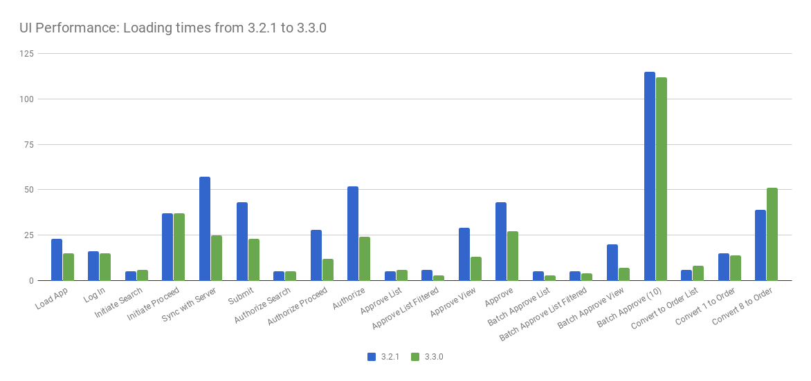

===================================
3.3.0 Release Notes - 27 April 2018
===================================

Status: Stable
==============

3.3.0 is a stable release, and all users of `OpenLMIS version 3
<https://openlmis.atlassian.net/wiki/spaces/OP/pages/88670325/3.0.0+Release+-+1+March+2017>`_ are
encouraged to adopt it.

Release Notes
=============

The OpenLMIS Community is excited to announce the **3.3.0 release** of OpenLMIS! It is another
major milestone in the version 3 `re-architecture <https://openlmis.atlassian.net/wiki/display/OP/Re-Architecture>`_
that allows more functionality to be shared among the community of OpenLMIS implementers.

3.3.0 includes a wide range of new features and functionality. The majority of the features were defined as the `Minimal Viable Product (MVP) <https://openlmis.atlassian.net/wiki/spaces/OP/pages/113144940/Vaccine+MVP>`_, or minimum feature set, to support countries in managing their immunization supply chain by a group of key immunization stakeholders and OpenLMIS community members. Key features include managing cold chain equipment (CCE) inventory, integrating with a Remote Temperature Monitoring (RTM) platform, calculating reorder amounts based on targets, fulfilling orders, and receiving commodities into inventory based on shipments. See the New Features section for details.

For a full list of features and bug-fixes since 3.2.1, see `OpenLMIS 3.3.0 Jira tickets
<https://openlmis.atlassian.net/issues/?jql=status%3DDone%20AND%20project%3DOLMIS%20AND%20fixVersion%3D3.3%20and%20type!%3DTest%20and%20type!%3DEpic%20ORDER%20BY%20%22Epic%20Link%22%20asc%2C%20key%20ASC>`_.

For information about future planned releases, see the `Living Product Roadmap
<https://openlmis.atlassian.net/wiki/display/OP/Living+Product+Roadmap>`_. Pull requests and
`contributions <http://docs.openlmis.org/en/latest/contribute/contributionGuide.html>`_ are welcome.

Compatibility
-------------

The requisition service introduced, `OLMIS-3929 <https://openlmis.atlassian.net/browse/OLMIS-3929>`_: View and edit multiple requisition templates per program, which requires a manual data migration explained `here <https://github.com/OpenLMIS/openlmis-requisition-template-migration>`_. 

The fulfillment service has a major release due to the additional features in fulfilling orders within OpenLMIS. Please review the fulfillment service changelog in detail to ensure a clear understanding of the breaking changes.

The reference data service uses new rights associated with the new proof of delivery functionality. Please review the changlog for the Reference data service in detail to ensure a clear understanding of the breaking changes related to rights.

**Batch Requisition Approval**: The Batch Approval screen, which was improved in OpenLMIS 3.2.1,
is still not officially supported. The UI screen is disabled by default. Implementations can
override the code in their local customizations in order to use the screen. Further performance
improvements are needed before the screen is officially supported. See `OLMIS-3182
<https://openlmis.atlassian.net/browse/OLMIS-3182>`_ and the tickets linked to it for details.

Backwards-Compatible Except As Noted
~~~~~~~~~~~~~~~~~~~~~~~~~~~~~~~~~~~~

Unless noted here, all other changes to OpenLMIS 3.x are backwards-compatible. All changes to data
or schemas include automated migrations from previous versions back to version 3.0.1. All new or
altered functionality is listed in the sections below for New Features and Changes to Existing
Functionality.

Upgrading from Older Versions
~~~~~~~~~~~~~~~~~~~~~~~~~~~~~

If you are upgrading to OpenLMIS 3.3.0 from OpenLMIS 3.0.x or 3.1.x (without first upgrading to
3.2.x), please review the `3.2.0
Release Notes <http://docs.openlmis.org/en/latest/releases/openlmis-ref-distro-v3.2.0.html>`_ for
important compatibility information about a required PostgreSQL extension and data migrations.

For information about upgrade paths from OpenLMIS 1 and 2 to version 3, see the `3.0.0 Release
Notes <https://openlmis.atlassian.net/wiki/spaces/OP/pages/88670325/3.0.0+Release+-+1+March+2017>`_.

Download or View on GitHub
--------------------------

`OpenLMIS Reference Distribution 3.3.0
<https://github.com/OpenLMIS/openlmis-ref-distro/releases/tag/v3.3.0>`_

Known Bugs
==========

Bug reports are collected in Jira for troubleshooting, analysis and resolution on an ongoing basis. See `OpenLMIS 3.3.0
Bugs <https://openlmis.atlassian.net/issues/?jql=project%3DOLMIS%20and%20type%3DBug%20and%20affectedVersion%3D3.3%20order%20by%20priority%20DESC%2C%20status%20ASC%2C%20key%20ASC>`_ for the current list of known bugs.

To report a bug, see `Reporting Bugs
<http://docs.openlmis.org/en/latest/contribute/contributionGuide.html#reporting-bugs>`_.

New Features
============

OpenLMIS 3.3.0 contains the following features, the majority are specific to the `Vaccine Module MVP  <https://openlmis.atlassian.net/wiki/spaces/OP/pages/113144940/Vaccine+MVP>`_ Features, were completed by the OpenLMIS development team:

- `Vaccine stock based requisitions <https://openlmis.atlassian.net/browse/OLMIS-4059>`_ that allow users to populate a requisition based on current stock levels and forecasted demand targets or ideal stock amounts.
- `Enhancements to support stock management for vaccines <https://openlmis.atlassian.net/browse/OLMIS-1293>`_.
- `Order fulfillment <https://openlmis.atlassian.net/wiki/spaces/OP/pages/88670474/Local+Fulfillment>`_, sometimes referred to as the process of resupplying supervised facilities. Includes support for configuring some facilities to have orders fulfilled within OpenLMIS and others sending orders to external suppliers like a National Store or third party supplier. Supports using the ideal product model, ordering using commodity types and fulfilling using TradeItems, to enable end-to-end visibility.
- `Receiving stock <https://openlmis.atlassian.net/wiki/spaces/OP/pages/88670483/Receiving+stock>`_ into inventory, using an electronic Proof of Delivery based on the shipment details created in OpenLMIS. 
- `Forecasting and Estimation features <https://openlmis.atlassian.net/browse/OLMIS-1294>`_ to upload forecasted demand targets and use those targets to calculate reorder amounts.
- Official release of the Cold Chain Equipment (CCE) service and includes a new feature displaying active alerts on specific pieces of equipment inventory using a standards based interoperability with a Remote Temperature Monitoring (RTM) platform. 
- `Administration screens <https://openlmis.atlassian.net/browse/OLMIS-4067>`_ included assigning requisition templates to facility types within a program, view and create facility types, and manage API keys. 
- The analytics infrastructure and DISC indicators were developed and deployed in a new open-source stack. By the 3.3 release, this technology infrastructure is not deployed within our dockerized microservice architecture. We can provide access to the demo environment for showcasing and will focus on deploying in docker for the next release.

The following Pull Requests were contributed by community members:

- Reference Data and Reference Data UI `OLMIS-3448 <https://openlmis.atlassian.net/browse/OLMIS-3448>`_
- Reference Data `OLMIS-4337 <https://openlmis.atlassian.net/browse/OLMIS-4337>`_
- Requisition `OLMIS-4383 <https://openlmis.atlassian.net/browse/OLMIS-4387>`_

Changes to Existing Functionality
=================================

Version 3.3.0 contains changes that impact users of existing functionality. Please review these
changes which may require informing end-users and/or updating your customizations/extensions:

- `OLMIS-3949 <https://openlmis.atlassian.net/browse/OLMIS-3949>`_: The **redesign of emergency requisitions** made large UI and API changes. Emergency requisitions now use a simplified template with limited columns. Please ensure to review all relevant documentation to understand the decision making, which went through the `product committee <https://openlmis.atlassian.net/wiki/spaces/OP/pages/199655438/PC+January+30+2018>`_, and major UI changes to alert relevant users.
- `OLMIS-3929 <https://openlmis.atlassian.net/browse/OLMIS-3929>`_: View and edit multiple requisition templates per program.
- `OLMIS-3166 <https://openlmis.atlassian.net/browse/OLMIS-3166>`_: Add user control for AppCache. Users can see their build number and update their web page application to the latest build.
- `OLMIS-3877 <https://openlmis.atlassian.net/browse/OLMIS-3877>`_: UI filter component is consistent across pages.
- `OLMIS-4026 <https://openlmis.atlassian.net/browse/OLMIS-4026>`_: Changed table styles to support order fulfillment complexity.

See `all 3.3.0 issues tagged 'UIChange' in Jira <https://openlmis.atlassian.net/issues/?jql=status%3DDone%20AND%20project%3DOLMIS%20AND%20fixVersion%3D3.3%20and%20type!%3DTest%20and%20type!%3DEpic%20and%20labels%20IN%20(UIChange)%20ORDER%20BY%20type%20ASC%2C%20priority%20DESC%2C%20key%20ASC>`_.

API Changes
===========

Some APIs have changes to their contracts and/or their request-response data structures. These
changes impact developers and systems integrating with OpenLMIS:

- Requisition service has a major release, v6.0.0, due to the redesign of emergency requisitions. See the Requisition changelog for details.
- Fulfillment service has a major release, v7.0.0, due to significant changes in the data model for orders, shipments and proofs of delivery. See the Fulfillment changelog for details.
- Reference data service has a major release, v10.0.0, due to changes for pagination, filtering and rights. See the Reference data changelog for details.
- Stock management service has a major release, v3.0.0, due to significant changes to stock events and physical inventory data. See the Stock management changelog for details.

Performance 
========================

OpenLMIS conducted manual performance tests of the same user workflows with the same test data we used in testing v3.2.1 to establish that last-mile performance characteristics have been retained at a minimum. For details on the test results and process, please see `this wiki page <https://openlmis.atlassian.net/wiki/spaces/OP/pages/116949318/Performance+Metrics>`_ for details. There are minor improvements in the sync, submit, authorize and single approve within the requisition service. For more details about the specific work done to improve performance for 3.3.0, please reference `this <https://openlmis.atlassian.net/issues/?jql=project%20%3D%20OLMIS%20AND%20issuetype%20%3D%20Task%20AND%20status%20%3D%20Done%20AND%20fixVersion%20%3D%203.3%20AND%20labels%20%3D%20Performance%20AND%20text%20~%20%22performance%22%20ORDER%20BY%20priority%20DESC%2C%20status%20ASC%2C%20key%20ASC>`_ list of tasks.

The following chart displays the 3.3.0 UI loading times in seconds for both 3.2.1 and 3.3.0 using the same test data. 

Test Coverage
=============

OpenLMIS 3.3.0 is the second release using the new `Release Candidate process
<http://docs.openlmis.org/en/latest/conventions/versioningReleasing.html#release-process>`_. As part
of this process, a full manual regression test cycle was conducted, and multiple release candidates
were published to address critical bugs before releasing the final version 3.3.0.

Manual tests were conducted using a set of 136 Zephyr tests tracked in Jira. A total of 50 bugs were
found during testing. The full set of tests were executed on the third Release Candidate (RC3).
With previous release candidates (RC1 and RC2), only the first phase of testing was conducted.
See the spreadsheet of all regression test executions for this release:
`3.3.0-regression-tests.csv <https://raw.githubusercontent.com/OpenLMIS/openlmis-ref-distro/master/docs/source/releases/3.3.0-regression-tests.csv>`_.

OpenLMIS 3.3.0 also includes a large set of automated tests. There are multiple types of tests,
including Unit Tests, Integration, Component, Contract and End-to-End. These tests exist in the API
services in Java as well as in the JavaScript UI web application. See the `Testing Guide
<http://docs.openlmis.org/en/latest/conventions/testing.html>`_.

For OpenLMIS 3.3.0, here are a few key statistics on automated tests:

- There are **2,665 unit tests** in the API services in Java, not including other types of tests
  nor tests in the Javascript UI application. `Sonar <http://sonar.openlmis.org/projects>`_ counts
  unit tests on each Java component.
- Test **coverage is over 60%** for all components, both Java and JavaScript, and is over 80% for
  many components. `Sonar <http://sonar.openlmis.org/projects>`_ tracks test coverage and fails
   quality gates if developers contribute new code with less than 80% coverage.

All of the automated tests, both Java and Javascript tests of all types, are passing as of the time
of the release. Any failing test would stop the build and block a release.

Further advances in automated testing are still on the horizon for future releases of OpenLMIS:

- Automated performance tests: There is already an automated test tool that measures the speed of
  API endpoints with a large set of performance test data. However, not all tests pass and there is
  not an established baseline for performance/speed of all areas of the system. Achieving this will
  greatly improve the objective means for tracking and improving performance.
- End-to-end testing: There is already an end-to-end testing toolset. However, coverage is very low.
  The addition of more end-to-end automated tests can reduce the manual test effort that is
  currently required for each release. It can help developers identify and fix regressions so the
  community can move towards a “continuous delivery” release process.

All Changes by Component
========================

Version 3.3.0 of the Reference Distribution contains updated versions of the components listed
below. The Reference Distribution bundles these component together using Docker to create a complete
OpenLMIS instance. Each component has its own own public GitHub repository (source code) and
DockerHub repository (release image). The Reference Distribution and components are versioned
independently; for details see `Versioning and Releasing
<http://docs.openlmis.org/en/latest/conventions/versioningReleasing.html>`_.

Auth Service 3.2.0
------------------

Source: `Auth CHANGELOG <https://github.com/OpenLMIS/openlmis-auth/blob/master/CHANGELOG.md>`_

CCE Service 1.0.0
-----------------

This is the first stable release of openlmis-cce.

Source: `CCE CHANGELOG <https://github.com/OpenLMIS/openlmis-cce/blob/master/CHANGELOG.md>`_

Fulfillment Service 7.0.0
-------------------------

Source: `Fulfillment CHANGELOG
<https://github.com/OpenLMIS/openlmis-fulfillment/blob/master/CHANGELOG.md>`_

Notification Service 3.0.5
--------------------------

Source: `Notification CHANGELOG
<https://github.com/OpenLMIS/openlmis-notification/blob/master/CHANGELOG.md>`_

Reference Data Service 10.0.0
-----------------------------

Source: `ReferenceData CHANGELOG
<https://github.com/OpenLMIS/openlmis-referencedata/blob/master/CHANGELOG.md>`_

Reference UI 5.0.6
------------------

The Reference UI (`https://github.com/OpenLMIS/openlmis-reference-ui/ <https://github.com/OpenLMIS/openlmis-reference-ui/>`_)
is the web-based user interface for the OpenLMIS Reference Distribution. This user interface is
a single page web application that is optimized for offline and low-bandwidth environments.
The Reference UI is compiled together from module UI modules using Docker compose along with the
OpenLMIS dev-ui. UI modules included in the Reference UI are:

auth-ui 6.1.0
~~~~~~~~~~~~~

See `openlmis-auth-ui CHANGELOG
<https://github.com/OpenLMIS/openlmis-auth-ui/blob/master/CHANGELOG.md>`_

cce-ui 1.0.0
~~~~~~~~~~~~

This is the first stable release of openlmis-cce-ui; it provides CCE inventory management and
administration screens that work with the openlmis-cce service APIs.

See: `openlmis-cce-ui CHANGELOG <https://github.com/OpenLMIS/openlmis-cce-ui/blob/master/CHANGELOG.md>`_

fulfillment-ui 6.0.0
~~~~~~~~~~~~~~~~~~~~

See `openlmis-fulfillment-ui CHANGELOG
<https://github.com/OpenLMIS/openlmis-fulfillment-ui/blob/master/CHANGELOG.md>`_

referencedata-ui 5.3.0
~~~~~~~~~~~~~~~~~~~~~~

See `openlmis-referencedata-ui CHANGELOG
<https://github.com/OpenLMIS/openlmis-referencedata-ui/blob/master/CHANGELOG.md>`_

report-ui 5.0.5
~~~~~~~~~~~~~~~

See `openlmis-report-ui CHANGELOG
<https://github.com/OpenLMIS/openlmis-report-ui/blob/master/CHANGELOG.md>`_

requisition-ui 5.3.1
~~~~~~~~~~~~~~~~~~~~

See `openlmis-requisition-ui CHANGELOG
<https://github.com/OpenLMIS/openlmis-requisition-ui/blob/master/CHANGELOG.md>`_

stockmanagement-ui 1.1.0
~~~~~~~~~~~~~~~~~~~~~~~~

See `openlmis-ui-components CHANGELOG
<https://github.com/OpenLMIS/openlmis-stockmanagement-ui/blob/master/CHANGELOG.md>`_

ui-components 5.3.0
~~~~~~~~~~~~~~~~~~~

See `openlmis-ui-components CHANGELOG
<https://github.com/OpenLMIS/openlmis-ui-components/blob/master/CHANGELOG.md>`_

ui-layout 5.1.0
~~~~~~~~~~~~~~~

See `openlmis-ui-layout CHANGELOG
<https://github.com/OpenLMIS/openlmis-ui-layout/blob/master/CHANGELOG.md>`_

Dev UI v7
~~~~~~~~~

The `Dev UI developer tooling <https://github.com/OpenLMIS/dev-ui>`_ has advanced to v7.

Report Service 1.0.1
--------------------

This service is intended to provide reporting functionality for other components to use. It is a
1.0.0 release which is stable for production use, and it powers one built-in report: the Facility
Assignment Configuration Errors report
(`OLMIS-2760 <https://openlmis.atlassian.net/browse/OLMIS-2760>`_).

Additional built-in reports in OpenLMIS 3.3.0 are still powered by their own services. In future
releases, they may be migrated to a new version of this centralized report service.

**Warning**: Developers should take note that the design of this service will be changing with
future releases. Developers and implementers are discouraged from using this 1.0.1 version to build
additional reports.

Source: `Report CHANGELOG <https://github.com/OpenLMIS/openlmis-report/blob/master/CHANGELOG.md>`_

Requisition Service 6.0.0
-------------------------

Source: `Requisition CHANGELOG
<https://github.com/OpenLMIS/openlmis-requisition/blob/master/CHANGELOG.md>`_

Stock Management 3.0.0
----------------------

Source: `Stock Management CHANGELOG
<https://github.com/OpenLMIS/openlmis-stockmanagement/blob/master/CHANGELOG.md>`_

Service Util 3.1.0
------------------

We now use an updated library for shared Java code called `service-util
<https://github.com/OpenLMIS/openlmis-service-util>`_.

Source: `Report CHANGELOG <https://github.com/OpenLMIS/openlmis-service-util/blob/master/CHANGELOG.md>`_

Components with No Changes
==========================

Other tooling components have not changed, including: the `logging service
<https://github.com/OpenLMIS/openlmis-rsyslog>`_, the Consul-friendly distribution of
`nginx <https://github.com/OpenLMIS/openlmis-nginx>`_, the docker `Postgres 9.6-postgis image
<https://github.com/OpenLMIS/postgres>`_, and the docker `scalyr image
<https://github.com/OpenLMIS/openlmis-scalyr>`_.

Contributions
=============

Many organizations and individuals around the world have contributed to OpenLMIS version 3 by
serving on our committees (Governance, Product and Technical), requesting improvements, suggesting features and writing code and documentation. Please visit our GitHub repos to see the list of individual contributors on the OpenLMIS codebase. If anyone who contributed in GitHub is missing, please contact the Community Manager.

Thanks to the Malawi implementation team who has continued to contribute a number of changes
that have global shared benefit.

Further Resources
=================

We are excited to announce the release of the first iteration of the Implementer Toolkit on the `OpenLMIS website <http://openlmis.org/get-started/implementer-toolkit/>`_.  Learn more about the `OpenLMIS Community <http://openlmis.org/about/community/>`_ and how to get involved!
