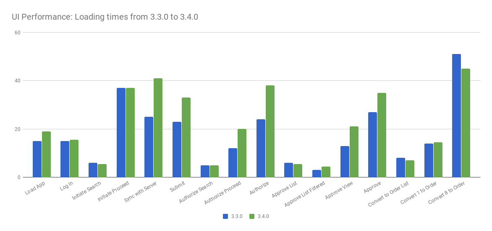

===================================
3.4.0 Release Notes - 13 August 2018
===================================

Status: Stable
==============

3.4.0 is a stable release, and all users of `OpenLMIS version 3
<https://openlmis.atlassian.net/wiki/spaces/OP/pages/88670325/3.0.0+Release+-+1+March+2017>`_ are
encouraged to adopt it.

Release Notes
=============

The OpenLMIS Community is excited to announce the **3.4.0 release** of OpenLMIS! It is another
major milestone in the version 3 `re-architecture <https://openlmis.atlassian.net/wiki/display/OP/Re-Architecture>`_
that allows more functionality to be shared among the community of OpenLMIS implementers.

For a full list of features and bug-fixes since 3.3.1, see `OpenLMIS 3.4.0 Jira tickets
<https://openlmis.atlassian.net/issues/?jql=status%3DDone%20AND%20project%3DOLMIS%20AND%20fixVersion%3D3.4%20and%20type!%3DTest%20and%20type!%3DEpic%20ORDER%20BY%20%22Epic%20Link%22%20asc%2C%20key%20ASC>`_.

For information about future planned releases, see the `Living Product Roadmap
<https://openlmis.atlassian.net/wiki/display/OP/Living+Product+Roadmap>`_. Pull requests and
`contributions <http://docs.openlmis.org/en/latest/contribute/contributionGuide.html>`_ are welcome.

Compatibility
-------------

Backwards-Compatible Except As Noted
~~~~~~~~~~~~~~~~~~~~~~~~~~~~~~~~~~~~

Unless noted here, all other changes to OpenLMIS 3.x are backwards-compatible. All changes to data
or schemas include automated migrations from previous versions back to version 3.0.1. All new or
altered functionality is listed in the sections below for New Features and Changes to Existing
Functionality.

Upgrading from Older Versions
~~~~~~~~~~~~~~~~~~~~~~~~~~~~~

If you are upgrading to OpenLMIS 3.4.0 from OpenLMIS 3.0.x or 3.1.x (without first upgrading to
3.2.x), please review the `3.2.0
Release Notes <http://docs.openlmis.org/en/latest/releases/openlmis-ref-distro-v3.2.0.html>`_ for
important compatibility information about a required PostgreSQL extension and data migrations.

For information about upgrade paths from OpenLMIS 1 and 2 to version 3, see the `3.0.0 Release
Notes <https://openlmis.atlassian.net/wiki/spaces/OP/pages/88670325/3.0.0+Release+-+1+March+2017>`_.

Download or View on GitHub
--------------------------

`OpenLMIS Reference Distribution 3.4.0
<https://github.com/OpenLMIS/openlmis-ref-distro/releases/tag/v3.4.0>`_

Known Bugs
==========

Bug reports are collected in Jira for troubleshooting, analysis and resolution on an ongoing basis. See `OpenLMIS 3.4.0
Bugs <https://openlmis.atlassian.net/issues/?jql=project%20%3D%20OLMIS%20AND%20issuetype%20%3D%20Bug%20AND%20affectedVersion%20%3D%203.4%20order%20by%20priority%20DESC%2C%20status%20ASC%2C%20key%20ASC>`_ for the current list of known bugs.

To report a bug, see `Reporting Bugs
<http://docs.openlmis.org/en/latest/contribute/contributionGuide.html#reporting-bugs>`_.

New Features
============

Changes to Existing Functionality
=================================

See `all 3.4.0 issues tagged 'UIChange' in Jira <https://openlmis.atlassian.net/issues/?jql=status%3DDone%20AND%20project%3DOLMIS%20AND%20fixVersion%3D3.4%20and%20type!%3DTest%20and%20type!%3DEpic%20and%20labels%20IN%20(UIChange)%20ORDER%20BY%20type%20ASC%2C%20priority%20DESC%2C%20key%20ASC>`_.

API Changes
===========

Performance
========================

OpenLMIS conducted manual performance tests of the same user workflows with the same test data we used in testing v3.2.1 to establish that last-mile performance characteristics have been retained at a minimum. For details on the test results and process, please see `this wiki page <https://openlmis.atlassian.net/wiki/spaces/OP/pages/116949318/Performance+Metrics>`_ for details. There are minor improvements in the sync, submit, authorize and single approve within the requisition service. For more details about the specific work done to improve performance for 3.4.0, please reference `this <https://openlmis.atlassian.net/issues/?jql=project%20%3D%20OLMIS%20AND%20issuetype%20%3D%20Task%20AND%20status%20%3D%20Done%20AND%20fixVersion%20%3D%203.4%20AND%20labels%20%3D%20Performance%20AND%20text%20~%20%22performance%22%20ORDER%20BY%20priority%20DESC%2C%20status%20ASC%2C%20key%20ASC>`_ list of tasks.

**UPDATE IMAGE**
The following chart displays the 3.4.0 UI loading times in seconds for both 3.3.1 and 3.4.0 using the same test data.

Test Coverage
=============

All Changes by Component
========================

Version 3.4.0 of the Reference Distribution contains updated versions of the components listed
below. The Reference Distribution bundles these component together using Docker to create a complete
OpenLMIS instance. Each component has its own own public GitHub repository (source code) and
DockerHub repository (release image). The Reference Distribution and components are versioned
independently; for details see `Versioning and Releasing
<http://docs.openlmis.org/en/latest/conventions/versioningReleasing.html>`_.

Auth Service 4.0.0
------------------

Source: `Auth CHANGELOG <https://github.com/OpenLMIS/openlmis-auth/blob/master/CHANGELOG.md>`_

CCE Service 1.0.1
-----------------

This is the first stable release of openlmis-cce.

Source: `CCE CHANGELOG <https://github.com/OpenLMIS/openlmis-cce/blob/master/CHANGELOG.md>`_

Fulfillment Service 7.0.1
-------------------------

Source: `Fulfillment CHANGELOG
<https://github.com/OpenLMIS/openlmis-fulfillment/blob/master/CHANGELOG.md>`_

Notification Service 4.0.0
--------------------------

Source: `Notification CHANGELOG
<https://github.com/OpenLMIS/openlmis-notification/blob/master/CHANGELOG.md>`_

Reference Data Service 11.0.0
-----------------------------

Source: `ReferenceData CHANGELOG
<https://github.com/OpenLMIS/openlmis-referencedata/blob/master/CHANGELOG.md>`_

Reference UI 5.4.0
------------------

The Reference UI (`https://github.com/OpenLMIS/openlmis-reference-ui/ <https://github.com/OpenLMIS/openlmis-reference-ui/>`_)
is the web-based user interface for the OpenLMIS Reference Distribution. This user interface is
a single page web application that is optimized for offline and low-bandwidth environments.
The Reference UI is compiled together from module UI modules using Docker compose along with the
OpenLMIS dev-ui. UI modules included in the Reference UI are:

auth-ui 6.1.1
~~~~~~~~~~~~~

See `openlmis-auth-ui CHANGELOG
<https://github.com/OpenLMIS/openlmis-auth-ui/blob/master/CHANGELOG.md>`_

cce-ui 1.0.1
~~~~~~~~~~~~

This is the first stable release of openlmis-cce-ui; it provides CCE inventory management and
administration screens that work with the openlmis-cce service APIs.

See: `openlmis-cce-ui CHANGELOG <https://github.com/OpenLMIS/openlmis-cce-ui/blob/master/CHANGELOG.md>`_

fulfillment-ui 6.0.1
~~~~~~~~~~~~~~~~~~~~

See `openlmis-fulfillment-ui CHANGELOG
<https://github.com/OpenLMIS/openlmis-fulfillment-ui/blob/master/CHANGELOG.md>`_

referencedata-ui 5.4.0
~~~~~~~~~~~~~~~~~~~~~~

See `openlmis-referencedata-ui CHANGELOG
<https://github.com/OpenLMIS/openlmis-referencedata-ui/blob/master/CHANGELOG.md>`_

report-ui 5.0.6
~~~~~~~~~~~~~~~

See `openlmis-report-ui CHANGELOG
<https://github.com/OpenLMIS/openlmis-report-ui/blob/master/CHANGELOG.md>`_

requisition-ui 5.4.0
~~~~~~~~~~~~~~~~~~~~

See `openlmis-requisition-ui CHANGELOG
<https://github.com/OpenLMIS/openlmis-requisition-ui/blob/master/CHANGELOG.md>`_

stockmanagement-ui 2.0.0
~~~~~~~~~~~~~~~~~~~~~~~~

See `openlmis-ui-components CHANGELOG
<https://github.com/OpenLMIS/openlmis-stockmanagement-ui/blob/master/CHANGELOG.md>`_

ui-components 6.0.0
~~~~~~~~~~~~~~~~~~~

See `openlmis-ui-components CHANGELOG
<https://github.com/OpenLMIS/openlmis-ui-components/blob/master/CHANGELOG.md>`_

ui-layout 5.1.1
~~~~~~~~~~~~~~~

See `openlmis-ui-layout CHANGELOG
<https://github.com/OpenLMIS/openlmis-ui-layout/blob/master/CHANGELOG.md>`_

Dev UI v8
~~~~~~~~~

The `Dev UI developer tooling <https://github.com/OpenLMIS/dev-ui>`_ has advanced to v8.

Report Service 1.1.1
--------------------

This service is intended to provide reporting functionality for other components to use. It is a
1.0.0 release which is stable for production use, and it powers one built-in report: the Facility
Assignment Configuration Errors report
(`OLMIS-2760 <https://openlmis.atlassian.net/browse/OLMIS-2760>`_).

Additional built-in reports in OpenLMIS 3.4.0 are still powered by their own services. In future
releases, they may be migrated to a new version of this centralized report service.

**Warning**: Developers should take note that the design of this service will be changing with
future releases. Developers and implementers are discouraged from using this 1.1.1 version to build
additional reports.

Source: `Report CHANGELOG <https://github.com/OpenLMIS/openlmis-report/blob/master/CHANGELOG.md>`_

Requisition Service 7.0.0
-------------------------

Source: `Requisition CHANGELOG
<https://github.com/OpenLMIS/openlmis-requisition/blob/master/CHANGELOG.md>`_

Stock Management 3.1.0
----------------------

Source: `Stock Management CHANGELOG
<https://github.com/OpenLMIS/openlmis-stockmanagement/blob/master/CHANGELOG.md>`_

Service Util 3.1.0
------------------

We now use an updated library for shared Java code called `service-util
<https://github.com/OpenLMIS/openlmis-service-util>`_.

Source: `Report CHANGELOG <https://github.com/OpenLMIS/openlmis-service-util/blob/master/CHANGELOG.md>`_

Components with No Changes
==========================

Other tooling components have not changed, including: the `logging service
<https://github.com/OpenLMIS/openlmis-rsyslog>`_, the Consul-friendly distribution of
`nginx <https://github.com/OpenLMIS/openlmis-nginx>`_, the docker `Postgres 9.6-postgis image
<https://github.com/OpenLMIS/postgres>`_, and the docker `scalyr image
<https://github.com/OpenLMIS/openlmis-scalyr>`_.

Contributions
=============

Many organizations and individuals around the world have contributed to OpenLMIS version 3 by
serving on our committees (Governance, Product and Technical), requesting improvements, suggesting features and writing code and documentation. Please visit our GitHub repos to see the list of individual contributors on the OpenLMIS codebase. If anyone who contributed in GitHub is missing, please contact the Community Manager.

Thanks to the Malawi implementation team who has continued to contribute a number of changes
that have global shared benefit.

Further Resources
=================

We are excited to announce the release of the first iteration of the Implementer Toolkit on the `OpenLMIS website <http://openlmis.org/get-started/implementer-toolkit/>`_.  Learn more about the `OpenLMIS Community <http://openlmis.org/about/community/>`_ and how to get involved!
